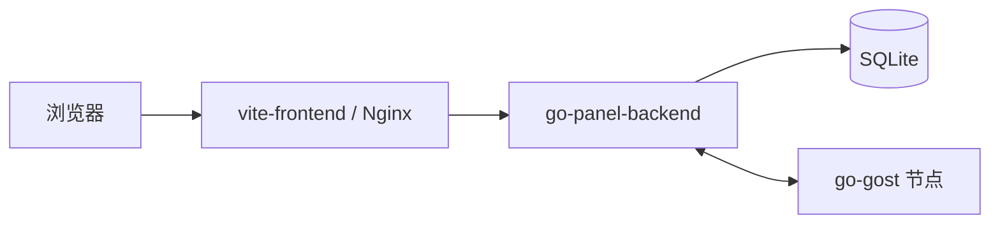

<div align="center">

# DLAMGO

一个面向低配置服务器场景的转发管理面板  
默认方案为 **Go + SQLite + Vite + Docker Compose**

[](https://github.com/GSDPGIT/dlamgo/actions/workflows/docker-build.yml)
[](https://github.com/GSDPGIT/dlamgo/actions/workflows/release.yml)
[](https://github.com/GSDPGIT/dlamgo/actions/workflows/docker-publish.yml)
[](./LICENSE)
[](./go-panel-backend)
[](./vite-frontend)

</div>

---

## 项目定位

DLAMGO 是当前仓库的默认运行方案，目标是替代旧的高内存 Java 面板部署方式，提供一套更轻量、更容易维护、更适合 1H1G 及低配服务器的面板架构。

当前默认、推荐、实际可部署的方案为：

- 前端：`vite-frontend`
- 后端：`go-panel-backend`
- 数据库：`SQLite`
- 节点通信：`go-gost`
- 默认部署方式：`Docker Compose`

---

## 快速导航

- [核心特性](#核心特性)
- [架构图](#架构图)
- [部署卡片](#部署卡片)
- [Docker Compose 快速开始](#docker-compose-快速开始)
- [源码运行](#源码运行)
- [节点接入](#节点接入)
- [仓库结构](#仓库结构)
- [归档说明](#归档说明)
- [CI 与发布](#ci-与发布)
- [常见问题](#常见问题)

---

## 核心特性

- 支持 TCP / UDP 转发
- 支持端口转发与隧道转发两种模式
- 支持用户级别流量、转发数量、到期时间控制
- 支持用户-隧道级别授权与配额控制
- 支持限速规则管理
- 支持节点在线状态与系统信息展示
- 支持通过 WebSocket 向节点下发服务、链路、限速等控制命令
- 默认使用 SQLite，部署轻量，适合低内存环境

---

## 架构图



---

## 部署卡片

| 方式 | 适用场景 | 推荐程度 | 说明 |
|---|---|---:|---|
| Docker Compose | 绝大多数用户 | 高 | 当前默认方案，最省事 |
| 源码运行 | 开发、调试、二次开发 | 中 | 适合本地联调 |
| 旧 Java 后端 | 历史兼容 | 低 | 已归档，不再作为默认部署方案 |

---

## Docker Compose 快速开始

### 1. 环境要求

- Docker Desktop，或 Docker Engine + Docker Compose

建议最低资源：

- CPU：1 核
- 内存：1 GB
- 磁盘：2 GB 以上可用空间

### 2. 准备环境变量

在仓库根目录执行：

```bash
cp .env.example .env
```

至少建议修改以下变量：

```env
BACKEND_PORT=6365
FRONTEND_PORT=6366
JWT_SECRET=请改成你自己的长随机字符串
ADMIN_USERNAME=admin_user
ADMIN_PASSWORD=请改成你自己的强密码
CORS_ALLOWED_ORIGINS=
LOGIN_RATE_LIMIT_PER_MINUTE=12
```

### 3. 启动

```bash
docker compose up --build -d
```

默认访问地址：

- 前端：`http://127.0.0.1:6366`
- 后端：`http://127.0.0.1:6365`

### 4. 常用命令

查看状态：

```bash
docker compose ps
```

查看后端日志：

```bash
docker compose logs -f backend
```

查看前端日志：

```bash
docker compose logs -f frontend
```

停止：

```bash
docker compose stop
```

删除容器但保留数据：

```bash
docker compose down
```

删除容器和数据卷：

```bash
docker compose down -v
```

### 5. 首次登录

如果你在 `.env` 中显式设置了：

```env
ADMIN_USERNAME=admin_user
ADMIN_PASSWORD=你的密码
```

那么直接使用这组账号密码登录即可。

如果没有设置 `ADMIN_PASSWORD`，后端会在首次启动时生成随机密码并写到日志中：

```bash
docker compose logs backend
```

---

## 源码运行

### 后端

```bash
cd go-panel-backend
go mod tidy
go run .
```

Windows PowerShell 示例：

```powershell
$env:APP_ADDR="127.0.0.1:6365"
$env:DATABASE_PATH=".\data\flux-panel.db"
$env:JWT_SECRET="your-secret"
$env:ADMIN_USERNAME="admin_user"
$env:ADMIN_PASSWORD="your-password"
go run .
```

### 前端

```bash
cd vite-frontend
npm install --legacy-peer-deps
npm run dev
```

本地开发默认连接：

```env
VITE_API_BASE=http://127.0.0.1:6365
```

---

## 节点接入

节点接入依赖面板中的“节点管理”和仓库中的：

- `go-gost`
- `scripts/install-node.sh`

### 1. 先配置面板后端地址

请先在面板“网站配置”中设置：

- `面板后端地址`

建议格式：

- `ip:port`
- `http://ip:port`
- `https://域名:端口`

### 2. 创建节点

在面板中：

1. 新建节点
2. 填写入口 IP、服务器 IP、端口范围
3. 保存后获取安装命令

### 3. 节点安装命令示例

```bash
curl -fsSL https://raw.githubusercontent.com/你的仓库/你的分支/scripts/install-node.sh -o ./install-node.sh && chmod 700 ./install-node.sh && ./install-node.sh -a 面板地址 -s 节点密钥
```

说明：

- `-a`：面板地址
- `-s`：节点密钥

---

## 仓库结构

### 当前默认使用

- `docker-compose.yml`
- `.env.example`
- `go-panel-backend`
- `vite-frontend`
- `go-gost`
- `scripts/install-node.sh`

### 新用户建议优先关注

- `README.md`
- `DOCKER.md`
- `.env.example`
- `docker-compose.yml`
- `go-panel-backend`
- `vite-frontend`
- `scripts/README.md`

### 新用户通常可以先忽略

如果你的目标只是部署当前默认版本，以下内容通常可以先忽略：

- `archive/legacy/springboot-backend`
- `archive/legacy/android-app`
- `archive/legacy/ios-app`
- `archive/legacy/docker-compose-v4.yml`
- `archive/legacy/docker-compose-v6.yml`
- `archive/legacy/panel_install.sh`
- `archive/legacy/install.sh`
- `archive/legacy/flux.ipa`

### 补充文档

- `DOCKER.md`
- `doc/仓库结构说明.md`
- `doc/发布流程建议.md`
- `archive/legacy/README.md`
- `SECURITY.md`
- `CONTRIBUTING.md`
- `CHANGELOG.md`

### 协作与模板

- `.github/ISSUE_TEMPLATE/`
- `.github/pull_request_template.md`
- `.github/release.yml`

---

## 归档说明

以下内容当前属于归档/兼容保留范围，并已迁移到 `archive/legacy/`：

- 旧 Java 后端
- Android / iOS 客户端工程
- 历史 Compose 文件
- 历史安装脚本
- 历史产物与旧 SQL 初始化文件

这些内容仍然保留，主要用于：

- 历史兼容
- 迁移参考
- 客户端工程保留
- 旧脚本留档

默认部署、默认维护、默认阅读路径都不再依赖它们。

---

## CI 与发布

### 持续集成工作流

- `.github/workflows/docker-build.yml`

当前默认用于校验：

1. Go 后端构建
2. 前端依赖安装与构建
3. Docker 后端镜像可构建
4. Docker 前端镜像可构建

### Release 工作流

- `.github/workflows/release.yml`

当你推送 `v*` 标签时，会自动：

1. 构建 Go 后端发布二进制
2. 构建前端静态产物
3. 校验 Docker 镜像可构建
4. 创建 GitHub Release
5. 上传发布附件

发布附件会包含：

- Go 后端二进制包
- 前端 dist 构建包
- `docker-compose.yml`
- `.env.example`
- `README.md`
- `DOCKER.md`
- `CHANGELOG.md`
- `VERSION.txt`
- `RELEASE_NOTES.md`
- `CHANGELOG-v版本号.md`
- `SHA256SUMS.txt`

### Docker Hub 发布工作流

- `.github/workflows/docker-publish.yml`

这个工作流在 `v*` 标签触发时会尝试发布：

- `linux/amd64`
- `linux/arm64`

并自动生成：

- `latest`
- 当前标签名

两个镜像标签。

启用前请先配置仓库 Secrets：

- `DOCKERHUB_USERNAME`
- `DOCKERHUB_TOKEN`

### 标签命名规范

建议统一使用：

- `v主版本.次版本.修订版本`

例如：

- `v0.1.0`
- `v0.1.1`
- `v0.2.0`

不建议使用：

- `release-1`
- `test`
- `final`

---

## 常见问题

### 1. `docker compose build` 拉镜像失败

请检查：

- Docker Desktop 是否已启动
- Docker 是否配置了正确代理
- 是否能正常拉取：

```bash
docker pull alpine:3.20
docker pull golang:1.23-alpine
docker pull node:20.19.0
docker pull nginx:stable-alpine
```

### 2. 登录后无法看到节点在线

请检查：

- 节点是否真的执行了安装脚本
- 面板“网站配置”中的后端地址是否正确
- 节点与面板之间的网络是否可达
- 反代是否放通了 `/system-info` WebSocket

### 3. 前端能打开但接口报错

请检查：

- 后端容器是否启动成功
- Nginx 是否正确代理 `/api/v1`
- 浏览器访问：

```bash
http://你的地址/api/v1/captcha/check
```

### 4. 前端安装依赖报 peer dependency 冲突

请使用：

```bash
npm install --legacy-peer-deps
```

---

## 推荐使用顺序

1. 修改 `.env`
2. 执行 `docker compose up --build -d`
3. 登录面板
4. 在网站配置中设置“面板后端地址”
5. 创建节点并获取安装命令
6. 节点安装完成后再创建隧道、用户和转发

---

## 安全说明

当前默认实现已经处理了以下问题：

- 管理员密码不再强制使用固定默认值
- 登录密码使用更安全的密码哈希
- 管理端 WebSocket 改为短时 `ticket` 鉴权
- 节点上报 HTTP 请求改为通过 Header 传递节点密钥
- 登录接口支持基础限速
- 默认采用 Go + SQLite，降低内存占用

更完整的安全说明请阅读：

- `SECURITY.md`

---

## 贡献

如果你希望参与改进，请阅读：

- `CONTRIBUTING.md`

---

## 免责声明

本项目仅供学习、研究与合法合规用途使用。

请勿将本项目用于任何违法、滥用、攻击、绕过授权或其他不当用途。

使用本项目造成的风险，包括但不限于：

- 服务异常
- 数据丢失
- 节点失联
- 网络封禁
- 法律风险

均由使用者自行承担。

---

## 许可证

本项目遵循仓库中的 `LICENSE`。
